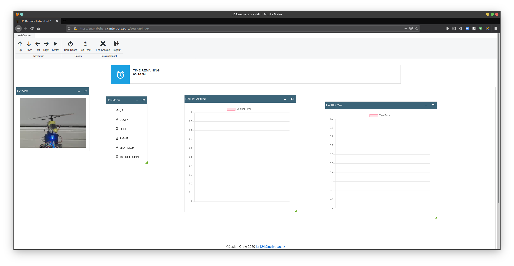

# ENCE464 Assignment 1

## Structure

### HeliLib
To simplify the code as much as possible using a separate heli library found in [lib/Heli](lib/Heli) This is included at build time.
This library was created to abstract hardware access for the Helicopter from the RTOS program. The HeliLib files can be accessed
from within the RTOS main program using `<heli/*.h>`. To change config options there is a config file: [heli_config.h](lib/Heli/heli_config.h).

### TivaWare
TivaWare is included in [TivaWare/](TivaWare) this is included in at build time by CMake, the build file for which is [here](TivaWare/CMakeLists.txt).
The driverlib and utils are included in the final project using `<driverlib/*.h>` and `<utils/*.h>`.

## Extensions
A few extensions for this project have been made, the first of which is allowing animations and the second is a menu extension using the HeliRig webpanel.

### Images/Animations
Arbitrary images and animations can be uploaded and displayed to the Tiva using the `gen_img.py` script found [here](scripts/).

### XSS Support
Due to the issues with the serial output of the HeliViewer not being sanitised the user can inject both html and script tags over UART to change the
webpage automatically this has been used to change the webpage to make the UI more attractive when operating the heli menu. The JavaScript for this can
be found [here](scripts/js).

#### Before

#### After

### Security Issues
Due to both the XSS vulnerability and the exposure of the OpenOCD and GDB ports on `4444` and `3333` respectively the XSS vulnerability
can be exploited and using the exposed GDB port `arm-none-eabi-gdb` can be connected to the remote target and a binary with XSS can be run on any HeliRig even
when someone else is using it. More details as well as an example script can be found [here](scripts/helirig-vulnerability) (This is only for research/fixing 
this scriptn is not to be used maliciously)

## Usage

### Building

### Flashing

### Differences from stock repo
This uses CMake so have some differences compared to the demo repo, this was made before that so for example this linker script is more complex. The CMakeLists.txt and files in [cmake](cmake) folder describe the building of the project

### Demo Code
The original demo code from Andre's repo can be found in [demo-code/](demo_code)

### Debugging
Using VSCode plus the `cortex-debug` extension will allow debugging.

## Authors
-   Jos Craw <jcr124@uclive.ac.nz>
-   Joshua Hulbert
-   Harry Dobbs
